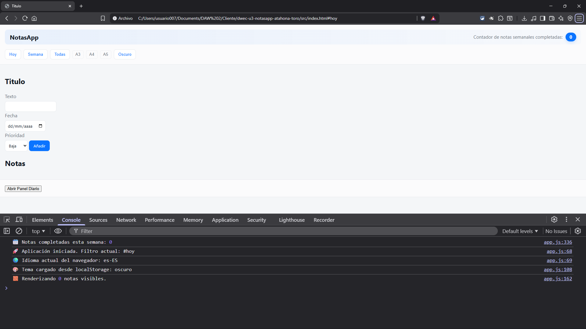
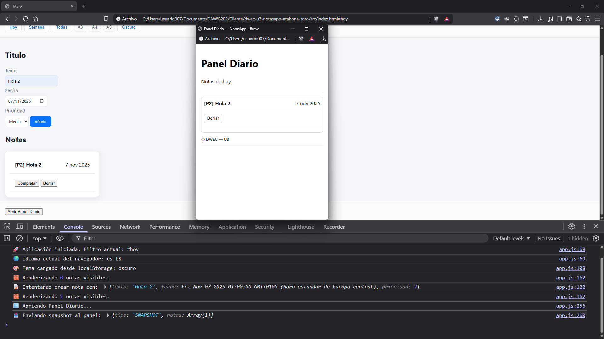
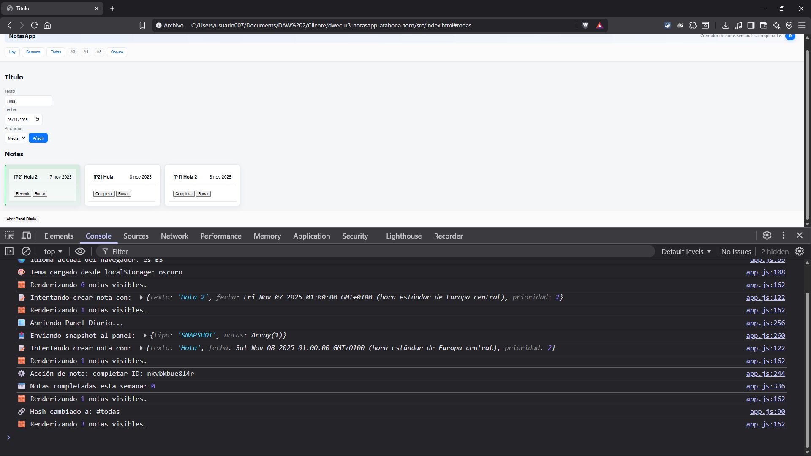

# NotasApp — DWEC U3 (Plantilla mínima)

**Objetivo**: implementar los RF acordados (objetos nativos; `navigator.language`; filtros por `location.hash`; generación de HTML; viewport/scroll/pantalla completa cuando proceda; `window.open`+comunicación controlada; persistencia elegida y justificada; depuración/documentación).

## Instrucciones rápidas
1. Abrir `src/index.html` en un navegador moderno.
2. Completar la lógica según los RF (ver enunciado de la UD).
3. Añadir evidencias de depuración (capturas) en este README o en la carpeta que decidas.

## Justificación de persistencia (rellenar)
- Mecanismo elegido: Cookies ☐  /  Web Storage ✅
- Motivo: Hemos optado por usar un Web Storage porque requeriamos de un almacenamiento local significativo y persistente, además que un webstorage tiene una mayor capacidad de almacenamiento, además nos ha permitido tener una persistencia mucho más controlada de los datos, diferenciado entre el almacenamiento temporal de las cookies, que tienen ciertas limitaciones y una mayor complejidad. Entre las opciones del Web Storage optamos por un Local Storage, esto, debido a su capacidad de alamacenar los datos incluso depués de cerrar el navegador, a diferencia del SessionStorage, que eliminará los datos y preferencias del usuario al cerrar la sesión (cerrar el navegador), es por ello que el LocalStorage fue la mejor opción, permitiendonos gestionar más volúmenes de datos de forma más eficiente y segura.

## Matriz RA–CE (referenciar funciones/flujo)
- Objetos nativos → Se han empleado objetos como Date, Array y JSON
- Interacción navegador (`navigator`, `location.hash`) → En este caso hemos utilizado navigator.language para establecer el idioma y location.hash para un filtrado dinámico
- Ventanas y comunicación → Uso del `window.open`, para abrir el Panel diario medioan el postMensagge. 
- Persistencia → La información se ha mantenido utilizando el `localStorage.getItem()` y `localStorage.getItem()` para guardar notas, preferencia de temas, tamaño, entre otros.
- Depuración y documentación → Mensajes de error con `Try-Catch` y fomateo de datos para evitar inconsistencias, además de comentatios JSDoc.

## Decisiones Claves y ayuda
Agregar más funcionalides al darle al boton completar para que se ponga el borde en verde, cambiar el botón de completar a revertir, y si se vuelve a pulsar se pone normal, hacer una función donde se traduzca la página detectando el idioma del navegador (solo funciona con inglés), sino por defecto está español, agregar el botón de claro/oscuro que cambia entre un archivo css a otro, y también lo mismo con a3, a4 y A5,para aumentar el tamaño de letra del navegador.En el caso de la persistencia se ha creado una función para cargar las notas al localStorage, permitiendo que perista incluso cuando se recargue el navegador, es importante destacar que dicha funcionalidad tambien se ha dado a los temas, y al panel, se han implementado formas de dobre escribirlo y es importante hacer el llamado de la función antes del render. Nos hemos ayudado de la plataforma de documentación de MDN para comprender el uso de algunas funciones, formato y como utilizarlo, además , también hemos acudido a Chat GPT, para consultar algunas cuestiones técnicas, o errores de lógica, para mejorar el funcionamiento del programa
 

© 2025-10-27 — DWEC
